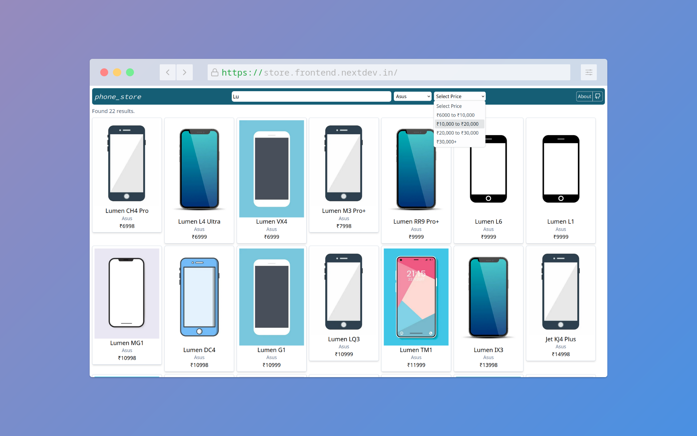

# Phone Store App

Visit: https://store.frontend.nextdev.in/

A Next.js store front website with search and filters running without any backend server. Fetches the data from a
PostgreSQL database using Next API routes and displays it client side. Filters work using a HashMap and modified binary
search to yield much faster results than linear searches.

`writedb.py` is a flask application that generates the store data and writes it to the database.