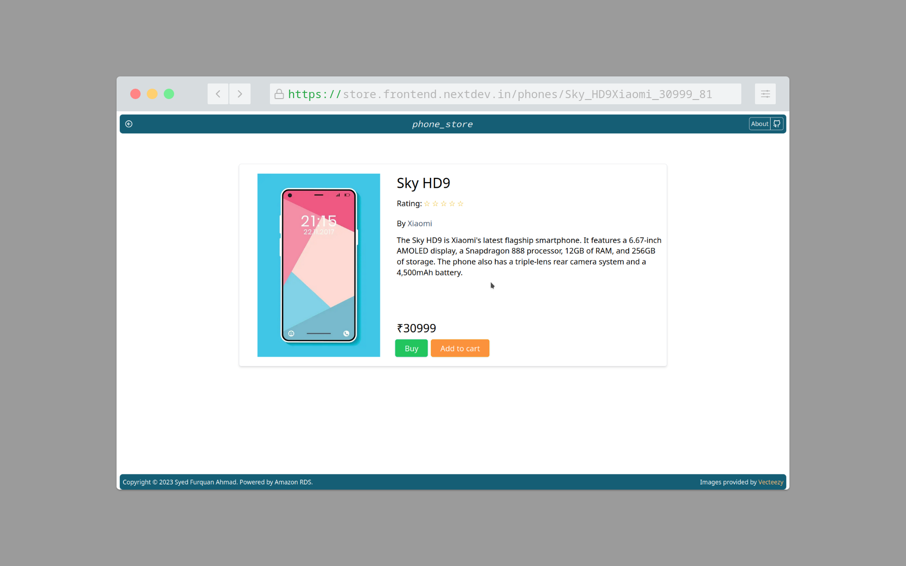

# Phone Store App

Visit: https://store.frontend.nextdev.in/

A Next.js store front website with search and filters running without any backend server. Fetches the data from a
PostgreSQL database (hosted on Amazon RDS) using Next API routes and displays it client side. Filters work using a
HashMap and modified binary search to yield much faster results than linear searches.

**`writedb.py`** is a Flask application that generates the store data and writes it to the database. It uses Google PaLM
API to prompt the LLM for textual descriptions of the procedurally generated data. The environment variables are as
follows:

* `WRITEDB_PALM_API_KEY` - The Google PaLM API key, check: https://makersuite.google.com/app/apikey
* `WRITEDB_LOGGING` ('true' or 'false') - If true the application will print the contents of the previous data before
dropping the tables
* `POSTGRES_DB_HOST` - The hostname for the PostgreSQL database
* `POSTGRES_DB_PORT` - The port for the PostgreSQL database
* `POSTGRES_DB_NAME` - The database name to write the generated data to
* `POSTGRES_DB_USERNAME` - The username for the PostgreSQL database
* `POSTGRES_DB_PASSWORD` - The password for the PostgreSQL database

