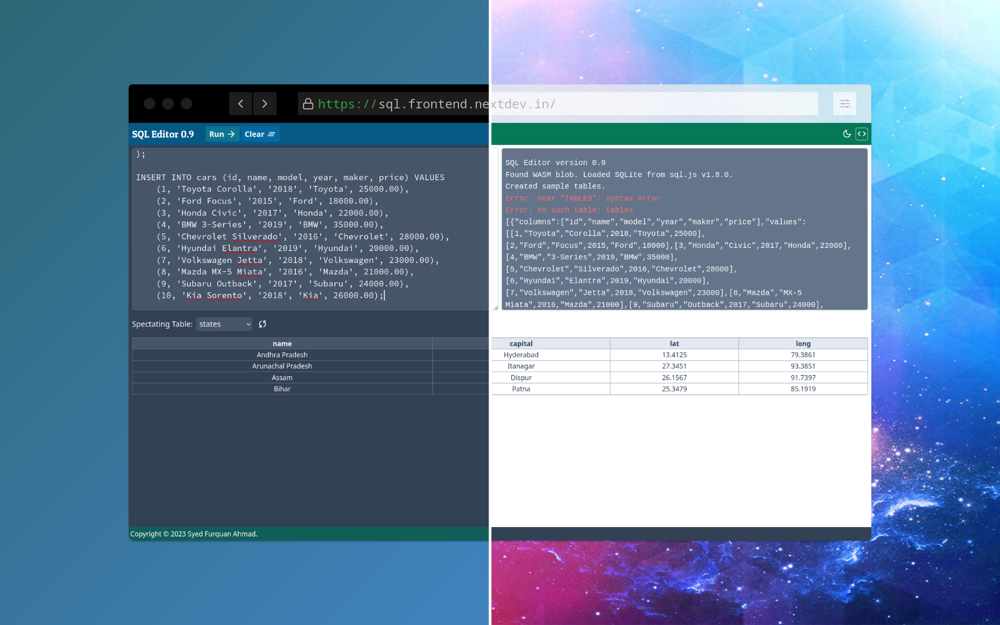

# SQL Editor

This is a backendless SQL Editor web application built with TypeScript, Next.js and [sql.js](https://sql.js.org), and 
styled with Tailwind. It runs SQLite inside the browser using WASM and thus requires no backend database (or server).

Visit live: https://sql.frontend.nextdev.in/

**Warning**: This web application uses WebAssembly (WASM) which may not be supported inside all browsers. Additionally 
some queries may be executed slowly and might produce no text on the output. If you cannot get any result despite 
clicking 'Run' multiple times, file an issue if you feel you're stuck.